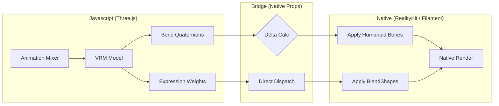
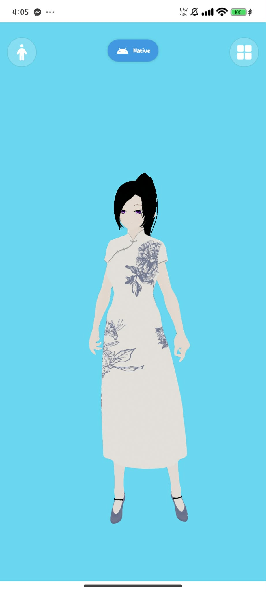
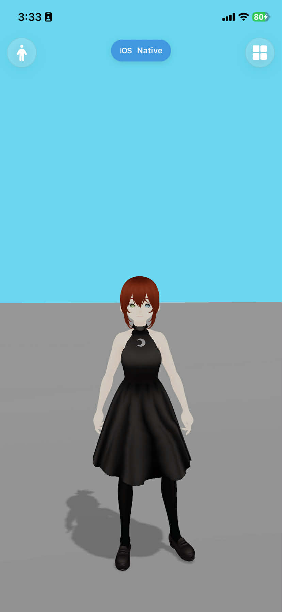

# VroidViewer
A React Native demo of [three-vrm](https://github.com/pixiv/three-vrm) with custom High-Performance Native Renderers.

### Platforms
✅ **Web**: Three.js + three-vrm (Standard implementation)  
✅ **Android**: Native renderer via **Filament + gltfio** (Android 12+)  
✅ **iOS**: Native renderer via **VRMKit + RealityKit** (iOS 18+)

---

## Expo & Native Management (`withNativeRestore`)

Because this project uses **Expo Prebuild**, the `ios/` and `android/` folders are transient and can be regenerated at any time. To keep our custom native code persistent and manageable, we use a specialized Expo Plugin: `plugins/withNativeRestore.js`.

### What it does:
1.  **Code Synchronization**: It maintains a "Source of Truth" in the `/native` top-level directory.
    - `native/android/vrm` ↔ `android/app/src/main/java/.../vrm`
    - `native/ios/NativeModules` ↔ `ios/NativeModules`
2.  **Automatic Injection**:
    - **Android**: Automatically registers the `NativeVrmPackage` in `MainApplication.kt` and adds Filament/Kotlin-Math dependencies to `build.gradle`.
    - **iOS**: Automatically registers all `.swift`, `.m`, and `.h` files from `NativeModules` into the Xcode PBXProject.
3.  **Environment Setup**: Ensures the correct JDK (21+) and Android SDK paths are configured in `gradle.properties` and `local.properties`.

---

## How iOS Rendering Works

The iOS renderer leverages **RealityKit**, Apple's high-performance AR/Rendering framework, wrapped by the **VRMKit** library.

### Architecture
- **Loader**: `ios/NativeModules/NativeVRMView.swift`
- **Engine**: RealityKit (using physically based materials).
- **VRM 1.x Compatibility**: Since VRMKit 0.7.1 is optimized for VRM 0.x, we use a **Metadata Shim** (in `VRMShimUtils.swift`) that intercept VRM 1.x models and injects a legacy VRM 0.x extension on-the-fly. This allows the RealityKit loader to recognize bone mappings and expressions for modern models.

### Key Logic:
- **Y-Axis Correction**: VRM 0.x models are automatically rotated 180° to face the camera, matching the Three.js convention.
- **Bone Mapping**: RealityKit entities are mapped to normalized humanoid bone names for consistent animation.

---

## How Android Rendering Works

The Android renderer uses **Google's Filament**, a real-time physically based rendering engine used in Google Search and Maps.

### Architecture
- **Loader**: Uses `gltfio` for efficient GLB parsing.
- **Surface**: Renders into a `TextureView` via `UiHelper` and `SwapChain` for seamless integration with React Native.
- **Render Loop**: Driven by a hardware-synced `Choreographer` callback.

### Custom VRM Implementation:
- **MToon Approximation**: Filament's standard PBR materials are procedurally adjusted based on VRM metadata to simulate anime-style shading (setting `baseColorFactor`, `shadeColor`, and disabling culling for hair).
- **Native Lip Sync**: Features a dedicated RMS-based audio analyzer that drives mouth morph targets directly on the GPU without JS overhead.
- **Spring Bones**: A native Kotlin implementation of the VRM Spring Bone physics system handles hair and clothing movement.

---

## JS → Native Bridge (Animation Sync)

Animations are computed in the Javascript thread using `three-vrm` to ensure logic parity across all platforms. The results are mirrored to the native renderers at 60fps.

### Architecture

### 1. The Sync Loop
Located in `src/features/fiberCanvas.tsx`, it uses a `requestAnimationFrame` loop to sample the JS model state and dispatch it to native views using `setNativeProps` for maximum performance, bypassing the standard React diffing cycle.

### 2. Bone Rotation Deltas
To support models with varying rest poses (T-Pose vs. A-Pose), we send **Relative Deltas** from the T-Pose rather than absolute rotations. The native logic applies these deltas to its own internal rest transform.

---

## Proof of Concept
| Android (Filament) | iOS (RealityKit) |
| :---: | :---: |
|  |  |

## Proof of Concept - LipSync
| Android (Filament) | iOS (RealityKit) |
| :---: | :---: |
| <video src="./assets/videos/Android-LipSync.mp4" width="300" autoplay loop/> | <video src="./assets/videos/iOS-LipSync.mp4" width="300" autoplay loop/> |

---

## Credits
- VRMKit package: [tattn](https://github.com/tattn/VRMKit)
- Audio files: [Akira Hoshino](https://www.youtube.com/@akira_hosh)

---
## Dev Setup
1. Clone this repo.
2. Run `bun i`.
3. Run `npx expo prebuild` (to generate native folders and trigger the restore plugin).
4. Run `npx expo run:android` or `npx expo run:ios`.

### Animations
To test the extra animations:
1. Download the [motion pack](https://vroid.booth.pm/items/5512385).
2. Extract to `assets/animations/motion_pack`.

---

### IMPORTANT NOTE
The `NativeVRMView` component **does not work in Expo Go**. You must use a Development Build or run via `npx expo run:[android|ios]`.
